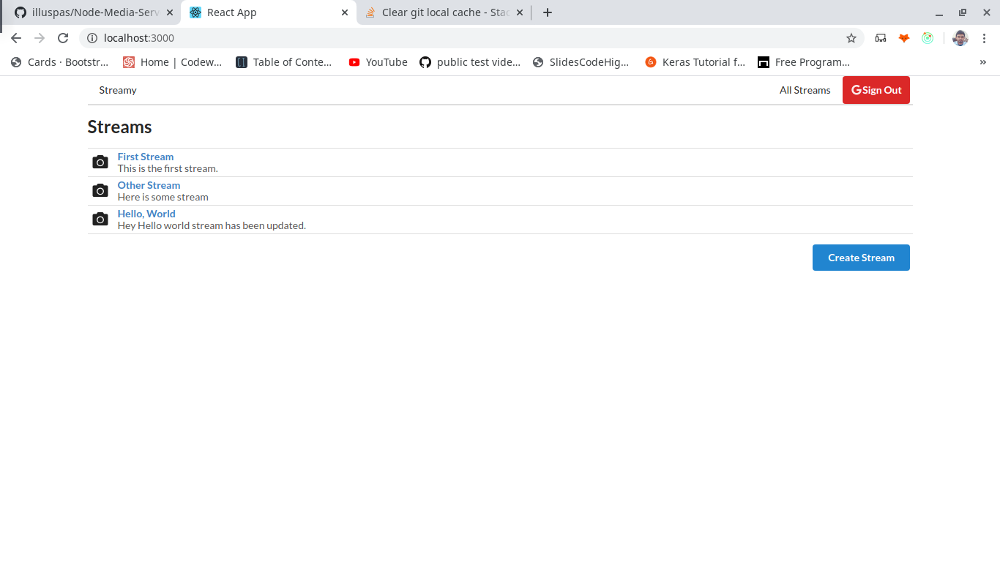

# Streams Application

The goal of the application is to understand:

* CRUD operations in React App
* Redux and Redux Thunk Integration in App
* Google OAuth implementation for login.

# Final Application:

# The application uses:

* ReactJS
* Redux
* React-Redux
* Redux-Thunk
* Redux Forms
* Redux Dev Tools

